  

<h3 align="center">A passionate Computer Science & Business Systems student and developer</h3>

---

### About Me
-  I’m currently studying **Computer Science & Business Systems**
-  I'm actively exploring software engineering, web security, and building cool projects.
-  I'm little bit better at ui & ux checkout my portfolio

---

### Tech Stack & Tools

  

---

### Quick Specs
| Category | Details |
| :--- | :--- |
| **Primary Role** | CSBS Student & Software Developer |
| **Institution** | PTR College of Engineering & Technology |
| **Core Interests** | Full-Stack Development, Web Security & Automation |
| **Passions** | AAA Gaming 🎮, Tech Experiments |

---
### 📫 Connect With Me

  
  
  
  
  

---
 

  <em>"اعقلها وتوكل"</em> 
   "Trust in God,but tie your camel."

